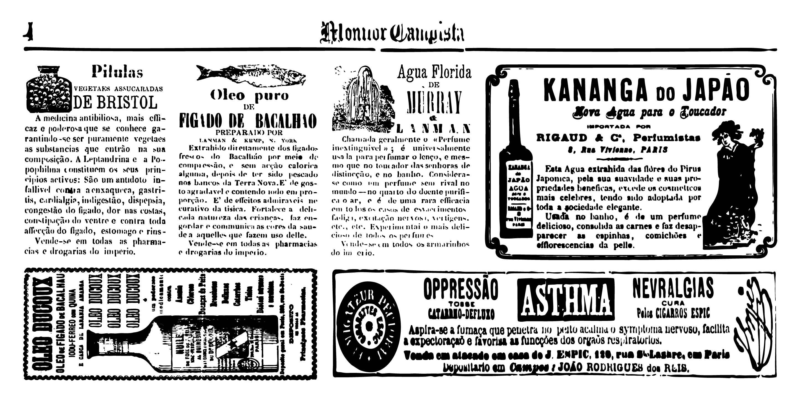
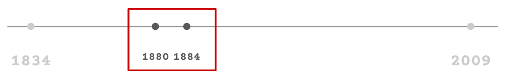
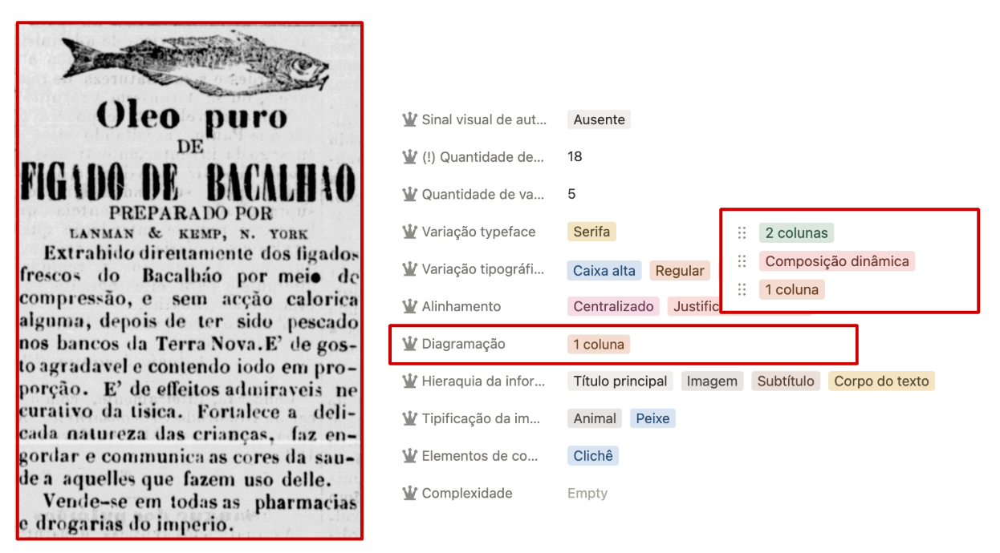
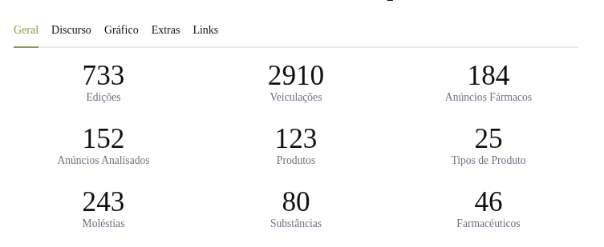
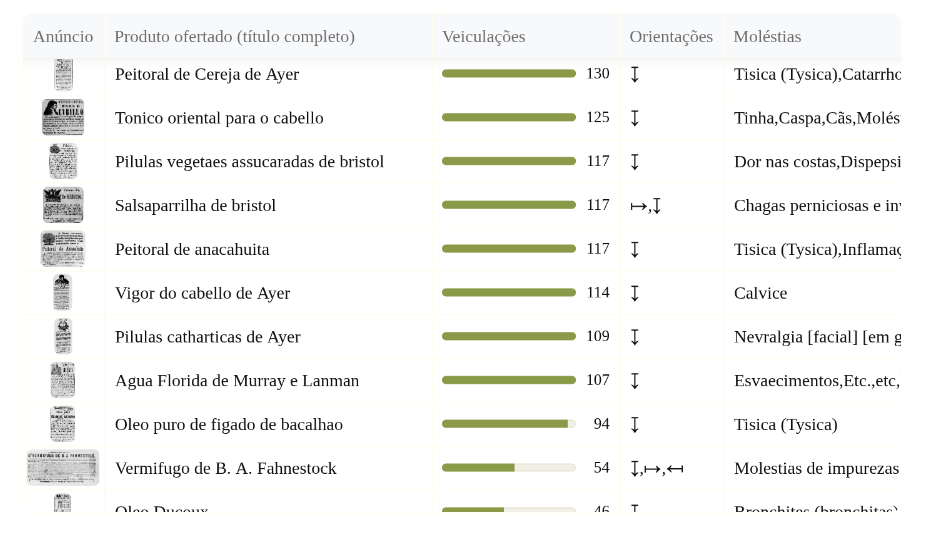
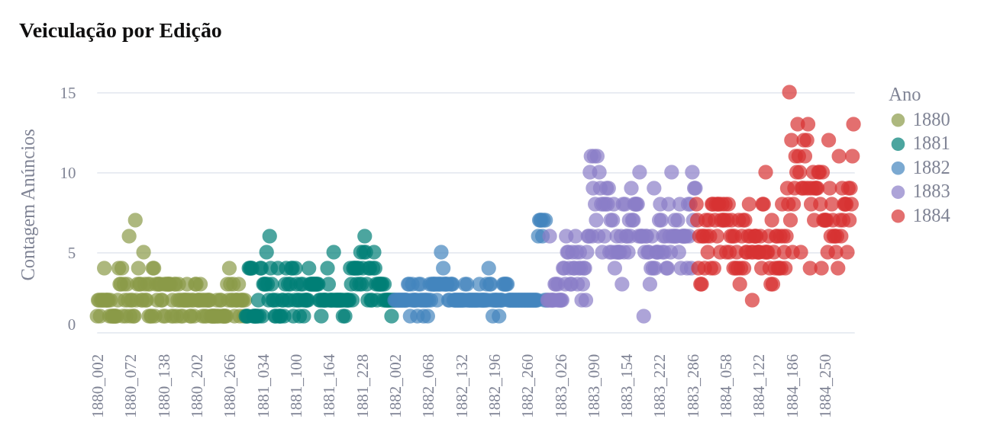
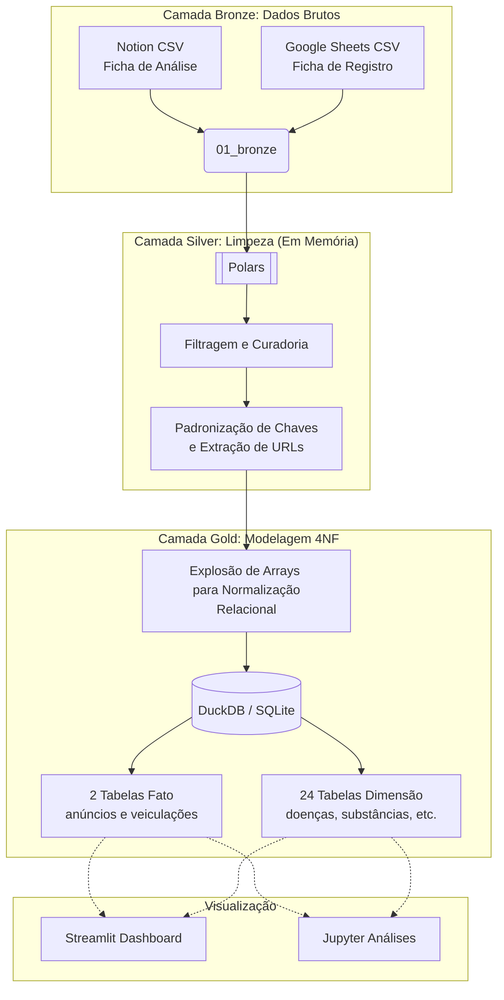

# Anúncios Farmacêuticos no Monitor Campista entre 1880 e 1884


Projeto de análise e visualização dos dados coletados no trabalho de conclusão de curso de [Dóris Peres](https://www.behance.net/drisperes1) para bacharelado em [Design Gráfico](https://portal1.iff.edu.br/nossos-campi/campos-centro/cursos-nova-interface/cursos-superiores/bacharelado-design-grafico). Você pode ler a monografia completa [aqui](https://bd.centro.iff.edu.br/jspui/handle/123456789/5158) e os slides [aqui](https://docs.google.com/presentation/d/1Df3J17v3NsET7FBPRfkxk0xAz6KsPHYGP8fx6s01JHo/edit?usp=sharing). Eu fui responsável por auxiliar a autora na estruturação técnica do projeto, especialmente a arquitetura, modelagem e processamento dos dados.  



Fundado na cidade de Campos dos Goytacazes (RJ) em 1834 e ativo até 2009, o *Monitor Campista* é um dos jornais mais antigos e longevos do Brasil. Podemos encontrar em suas páginas todos os grandes acontecimentos ao longo desses três séculos de publicação. Uma janela única para observar o passado quando ele ainda era presente. Podemos, por exemplo, nos emocionar junto com o [povo na rua, bandas de música e estandartes comemorando a Lei Áurea](https://memoria.bn.gov.br/docreader/DocReader.aspx?bib=030740&pagfis=16274). Também podemos inferir como os eventos históricos foram apresentados e recebidos pela população local, com todas as nuances e camadas que um veículo jornalístico de determinada tendência, em uma determinada época, escrevendo para determinados leitores, pode oferecer. Suas páginas testemunharam desde a [Declaração da Maioridade em 1840](https://memoria.bn.gov.br/docreader/DocReader.aspx?bib=030740&pagfis=1813), a [chegada da iluminação elétrica na cidade em 1883](https://memoria.bn.gov.br/docreader/DocReader.aspx?bib=030740&pagfis=9035), os ciclos econômicos do açúcar, do café e até o *boom* das *commodities* e a [crise do subprime em 2007](https://memoria.bn.gov.br/docreader/DocReader.aspx?bib=030740&pagfis=104564). O jornal sobreviveu às sucessivas rupturas institucionais e processos de redemocratização do Brasil.

A monografia focou em um recorte específico desse vasto acervo: os anúncios de fármacos veiculados entre 1880 e 1884. Anúncios, porque são a síntese visual de intenções, relações de comércio, consumo e discurso. Fármacos, em particular, por capturarem aspectos de saúde e doença, desejos e medos, temas que atravessam todas as sociedades e épocas, mas que se manifestam de formas particulares em cada contexto histórico e social. Por fim, o início da década de 1880 foi escolhido por marcar um período de grandes transformações que culminariam na abolição da escravatura e na proclamação da República.



Assim, foi construída uma [ficha de registro](https://docs.google.com/spreadsheets/d/1Be14RT5XPDtsarD1-NpYpkqV5BgyXIQQFt36iCaCsY4/edit?usp=sharing) para capturar cada veiculação de [cada anúncio](https://drive.google.com/drive/folders/1HyZi_paov0iWure1DvHzdd5A1TtI0gqu) de cada edição analisada. Finalizado o registro, cada anúncio **distinto** foi analisado em uma [ficha de análise](https://www.notion.so/262d075ca712800887f6fe4774477031?v=262d075ca71280cd90c6000c052909ba) com 33 propriedades como "Doenças mencionadas","Substâncias mencionadas","Palavras-chave de efeito","Discursos de autoridade", "Variação tipográfica", "Elementos de composição", etc. 



Finalmente, todos esses dados foram processados conforme a pipeline de dados implementada nesse projeto. Utilizei o [Jupyter Lab](https://jupyter.org/install) para exploração e desenvolvimento inicial, o [Polars](https://pola.rs/) para tratamento de dados, o [DuckDB](https://duckdb.org/) para armazenamento e consulta, e o [Streamlit](https://streamlit.io/) para visualização final.







Você pode acessar a visualização final [aqui](https://pharma1880.streamlit.app/), explorar os dados diretamente no [Notion (ficha de análise)](https://www.notion.so/262d075ca712800887f6fe4774477031?v=262d075ca71280cd90c6000c052909ba) ou [Google Sheets (ficha de registro)](https://docs.google.com/spreadsheets/d/1Be14RT5XPDtsarD1-NpYpkqV5BgyXIQQFt36iCaCsY4/edit?usp=sharing), baixar o banco de dados consolidado em formato [SQLite](https://github.com/danibritods/pharma1880/raw/refs/heads/main/data/03_gold/monitor_campista_pharma_ads_1880_1884.db) ou [DuckDB](https://github.com/danibritods/pharma1880/raw/refs/heads/main/data/03_gold/monitor_campista_pharma_ads_1880_1884.duckdb), ou executar o projeto localmente seguindo as instruções abaixo.

## Como consumir os dados

Pensando em acessibilidade e performance técnica, o banco consolidado está disponível em dois formatos na pasta `data/03_gold/`:
*   `*.duckdb`: Formato colunar otimizado para rápida leitura analítica (OLAP). Recomendado para uso analítico avançado com Python, Polars e fluxos de dados modernos.
*   `*.db` (SQLite): Formato universal. Ideal para máxima compatibilidade, onde pesquisadores, analistas ou curiosos podem inspecionar rapidamente os dados usando interfaces visuais (como o [DB Browser for SQLite](https://sqlitebrowser.org/)) sem a necessidade de configurar um ambiente.

## Organização do Projeto
```
pharma1880/
├── .gitignore 
├── README.md
├── pyproject.toml
├── LICENSE
│
├── data/
│   ├── 01_bronze/
│   │   ├── notion_ficha_analise.csv
│   │   └── sheets_ficha_registro_veiculacoes.csv
│   ├── 02_silver/                              # vazio por design (ver Arquitetura de Dados)
│   └── 03_gold/
│       ├── monitor_campista_pharma_ads_1880_1884.duckdb 
│       └── monitor_campista_pharma_ads_1880_1884.db 
│
├── notebooks/
│   ├── 01_cleaning.ipynb
│   ├── 02_analysis.ipynb
│   └── 03_visualization.ipynb
│
└── src/
    └── monitor_campista/
        ├── __init__.py
        ├── pipeline.py
        └── dashboard.py
```

## Arquitetura de Dados

Desenhamos a estrutura das fichas de registro e análise para garantir a viabilidade técnica (*feasibility*) de capturar e analisar manualmente quase 2.000 veiculações de anúncios do século XIX. As colunas foram estruturadas desde o início em formato *tidy*, mantendo a inserção simples para a pesquisa em campo e o processamento posterior direto.

Os dados fluem seguindo o padrão da Arquitetura Medalhão:

1. **Bronze:** extraímos os dados diretamente dos CSVs das planilhas de coleta (Google Sheets e Notion). Aqui, propriedades multivaloradas de um anúncio (ex: uma única propaganda citando as doenças Tosse, Tuberculose e Febre ao mesmo tempo) coexistem como strings separadas por vírgulas.
2. **Silver (Em Memória):** carregamos os dados, filtramos registros inválidos, padronizamos nomes de propriedades e extraímos URLs das imagens. Uma decisão arquitetural aqui foi não gerar artefatos físicos no disco. Como o App consome diretamente o banco final, não há caso de uso intermediário.
3. **Gold (Modelagem Dimensional em 4NF):** tabelas achatadas com arrays trazem *overhead* a cada consulta. Para evitar isso, "explodimos" cada uma das 24 propriedades multivaloradas da ficha de análise em sua própria tabela dimensional, gerando relações puras de um-para-muitos. As propriedades de valor único (Preço, Depósito, etc.) permanecem na tabela fato `anuncios` — uma linha por anúncio distinto. Junto à tabela fato `veiculacoes` (oriunda da ficha de registro) e uma tabela auxiliar de derivações, o banco totaliza **27 tabelas**. Ao isolar atributos multivalorados independentes, garantimos a semântica típica de **Quarta Forma Normal (4NF)**, e o DuckDB consegue realizar *joins* e agregações instantaneamente.



## Tutorial

O único pré-requisito desse projeto é o [uv](https://docs.astral.sh/uv/getting-started/installation/), ele resolve todo o resto.

Para reconstruir os bancos de dados a partir dos CSVs brutos:
```bash
uv run update-data
```

Para explorar os dados interativamente em Jupyter:
```bash
uv run jupyter lab
```

Para visualizar o dashboard:
```bash
uv run streamlit run src/monitor_campista/dashboard.py
```

## Ferramentas utilizadas

* [uv](https://docs.astral.sh/uv/) - A única ferramenta de gerenciamento de pacotes e ambientes Python da atualidade. Sério. Se não conhece, pare tudo o que está fazendo e vá testar. Escrita em Rust, ela resolve absolutamente todas as dores de cabeça com dependências do ecossistema Python em milissegundos.
* [Jupyter Lab](https://jupyter.org/install) - Para as explorações e análises iniciais em Notebooks.
* [Polars](https://pola.rs/) - Para tratamento e manipulação extremamente veloz e elegante dos dados (pandas do futuro).
* [DuckDB](https://duckdb.org/) - Como motor analítico principal (OLAP) para a visualização.
* [Streamlit](https://streamlit.io/) - Para construção da página/dashboard.
* [SQLite](https://sqlite.org/index.html) - Como formato de exportação alternativo para máxima acessibilidade externa.


## Licença

 [MIT](LICENSE)

## Créditos

Esse documento foi inspirado no [template para um bom README.md](https://gist.github.com/PurpleBooth/109311bb0361f32d87a2)
